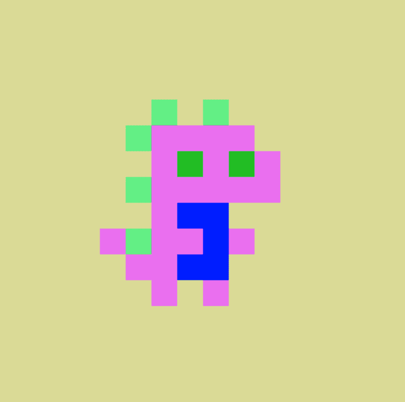

# Tiny Dinos Collection

Tiny Dinos Collection 是 Polygon 区块链上的 NFT。 根据定义的稀有系统，这 5,000 只小恐龙中的每一个都具有使它们独一无二的属性。过去 7 天没有售出 Tiny Dinos 系列。
在这个独特的系列中发现最好的物品。

Tiny Dinos Collection NFT - 常见问题（FAQ）
▶ 什么是 Tiny Dinos 系列？
Tiny Dinos Collection 是一个 NFT（Non-fungible token）集合。存储在区块链上的数字艺术品集合。
▶ Tiny Dinos Collection 代币有多少？
总共有 4,170 个 Tiny Dinos Collection NFT。目前，84 位车主的钱包中至少有一个 Tiny Dinos Collection NTF。
▶ 最近卖出了多少个 Tiny Dinos Collection？
过去 30 天内售出 0 个 Tiny Dinos Collection NFT。
▶ 有哪些流行的 Tiny Dinos Collection 替代品？
许多拥有 Tiny Dinos Collection NFT 的用户还拥有 The Crypto Punk Collection、 The Matrix Crypto Punk Collection、 MoonBirds Sight和 Baby Princess Ape Club(BPAC)。

