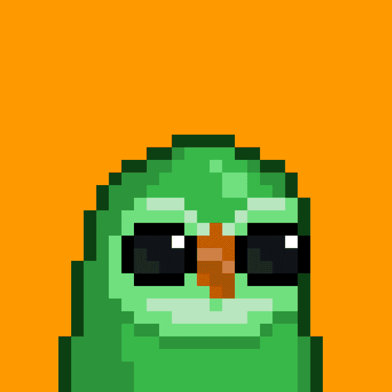

# tiny moonbirds

进入独家 Alpha 组并可兑换商品。 过去 7 天没有出售任何小型月鸟。我们的免费薄荷糖现已上线。

前 200 枚薄荷糖免费，之后 0.0025 枚薄荷糖。

最多 3 个免费薄荷

https://etherscan.io/address/0xeba336f01918736ba58c91e8d2c1ece569fd0cf9

#NFT #NFTs #NFTCommunity @moonbirds_xyz

tiny moonbirds NFT - 常见问题（FAQ）
▶ 什么是小月鸟？
tiny moonbirds 是一个 NFT（非同质代币）集合。存储在区块链上的数字艺术品集合。
▶ 有多少个小月鸟代币？
总共有 999 个小月鸟 NFT。目前，131 位车主的钱包里至少有一只小月鸟 NTF。
▶ 最近卖出了多少只小月鸟？
过去 30 天内售出 0 个小月鸟 NFT。

