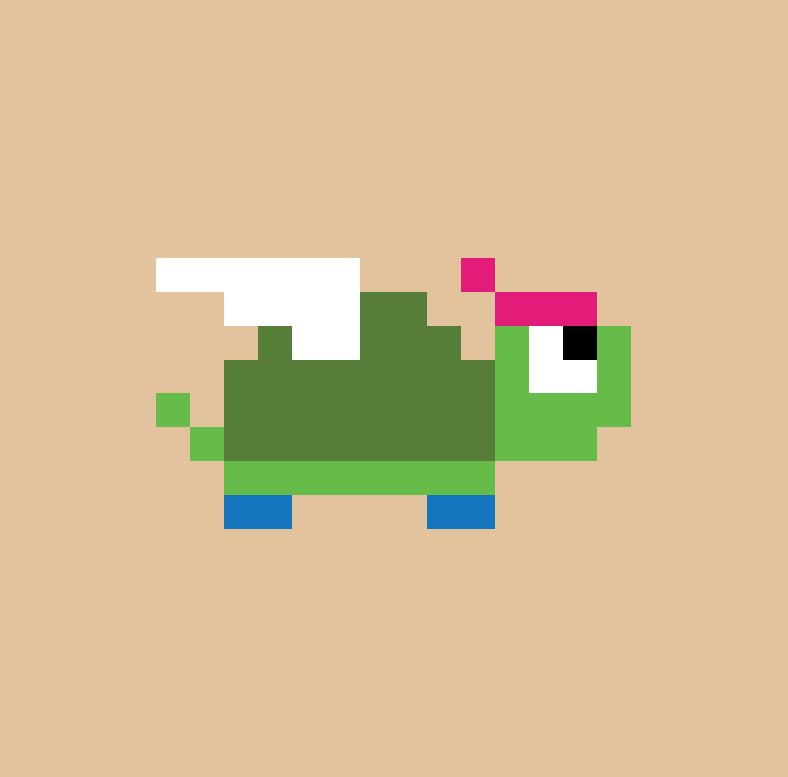

# Tiny Winged Turtlez

Tiny Winged Turtlez 是多达 5,000 个完全链上的集合，在铸币时随机生成，带有翅膀的小乌龟。

Tiny Winged Turtlez 是多达 5,000 个完全链上 NFT 的集合。没有链下 API 或资产存储。除了这个网站，Tiny Winged Turtlez 只使用它的智能合约来运行。因为所有艺术品和元数据都是 100% 生成并存储在以太坊区块链上的。一些 Turtlez 比其他的更罕见。
当您在钱包中持有相应数量的 Tiny Winged Turtlez 时，您将获得越来越多的好处：
持有的每只小翼龟都会为您提供 1 次进入发布活动的赠品，价值高达 30 ETH。

仅访问 Turtlez 社区频道，包括我们一起分析更广泛的 NFT 空间的 Alpha Zone。

帮助您开始使用 web3、应对常见挑战并确保资产安全的指南。
参加一个演练课程，教您如何逐步创建像 Tiny Winged Turtlez 这样的 NFT 项目。3 个模块现已上线！

获得 Tiny Winged Turtlez 合作伙伴项目的薄荷名单机会。小翅龟
获取 Tiny Winged Turtlez NFT 项目的所有源代码，这样您就可以自己快速启动一个类似的项目。

Mint Turtlez 立即获得特权：

连接钱包龟甲图龟普通型龟僵尸类型海龟机器人类型

龟外星人类型
在每个阶段，3 名随机海龟持有者将从一个流行的全链上像素艺术项目中空投 1 个 NFT。为了获得资格，当达到以下薄荷阈值时，只需持有一只小翼龟：
在铸造了 1,667 个 Turtlez 时，将从项目 1 中空投 3 个 NFT。

