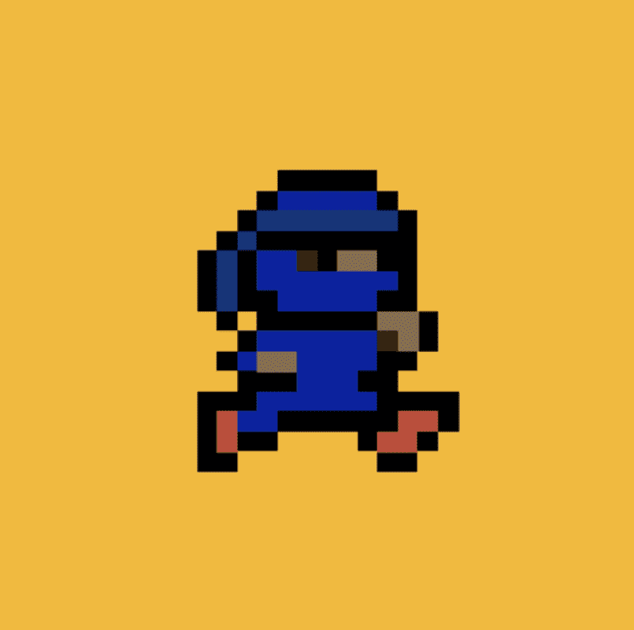

# Tiny Ninjas (eth)

过去 7 天内没有售出 Tiny Ninjas (eth)。

很小，但很强大。

10,000 个 cc0 小忍者中的 1 个在 7 个不同的链中铸造。

Tiny Ninjas (eth) NFT - 常见问题（FAQ）
▶ 什么是 Tiny Ninjas (eth)？
Tiny Ninjas (eth) 是一个 NFT (Non-fungible token) 集合。存储在区块链上的数字艺术品集合。
▶ 有多少 Tiny Ninjas (eth) 代币？
总共有 4,800 个 Tiny Ninjas (eth) NFT。目前，2,201 位所有者的钱包中至少有一个 Tiny Ninjas (eth) NTF。
▶ 最近卖出了多少 Tiny Ninjas (eth)？
过去 30 天内售出了 2 个 Tiny Ninjas (eth) NFT。
▶ 什么是流行的 Tiny Ninjas (eth) 替代品？
许多拥有 Tiny Ninjas (eth) NFT 的用户还拥有 Tiny Serpents、 dadmfers、 CockCockCOCKROACH和 CLAYPETS。

