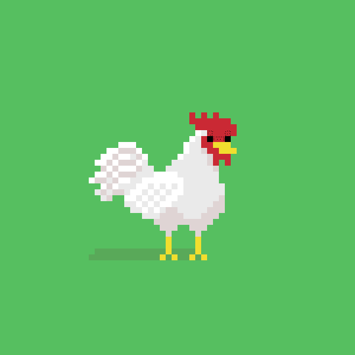

# tiny roosters(eth)

小公鸡（eth）统计
创建于 5 个月前
2,000 代币供应
10% 费用
过去 7 天内没有出售任何小公鸡（eth）。

cc0 全链小公鸡 nft 在 7 个不同的链上铸造，并可在每个链之间转移
▶ 什么是小公鸡（eth）？
tiny roosters(eth) 是一个 NFT（不可替代令牌）集合。存储在区块链上的数字艺术品集合。
▶ 存在多少个小公鸡（eth）代币？
总共有 2,000 个小公鸡（eth）NFT。目前，488 位业主的钱包中至少有一只小公鸡（eth）NTF。
▶ 最近卖出了多少只小公鸡（eth）？
过去 30 天内售出 0 个小公鸡 (eth) NFT。
▶ 什么是流行的小公鸡（eth）替代品？
许多拥有 tiny roosters(eth) NFT 的用户还拥有 My Shower Diaries、 DWARFTowns.wtf、 Meta & Magic Heroes和 Save A Bears。

