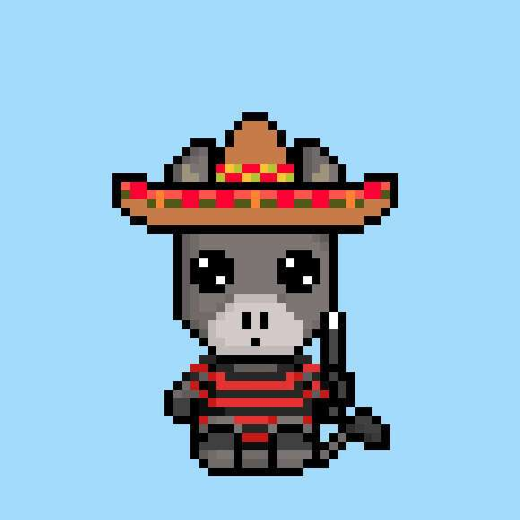

# TinyTails

什么是小尾巴？
Tiny Tails 是生活在以太坊区块链上的 5,000 只虚拟宠物的集合。每个 Tiny Tail 都是完全独特的，并通过 130 多种不同的设计以编程方式生成。我们将把所有版税的 7% 捐赠给专注于动物福利和野生动物保护的非营利组织。
‍ 捐赠
将每季度进行一次，我们的社区也可以对我们捐赠的组织有发言权。
2022 年第三季度
商品
我们的在线商品商店将推出！我们所有的持有者都获得了免费的商品积分！
2022 年第四季度
互动游戏
我们正在与一家游戏开发公司合作开发一款游戏，让您可以与虚拟宠物互动并照顾您的虚拟宠物以换取奖励。
有关开发的详细信息将发布在我们的 Discord 中。
进行中
奖励
我们的社区就是一切。
为了表达我们的支持，我们将通过空投奖励我们的持有者！ 
待定
元界整合
更多细节将在我们路线图的下一阶段公布。

