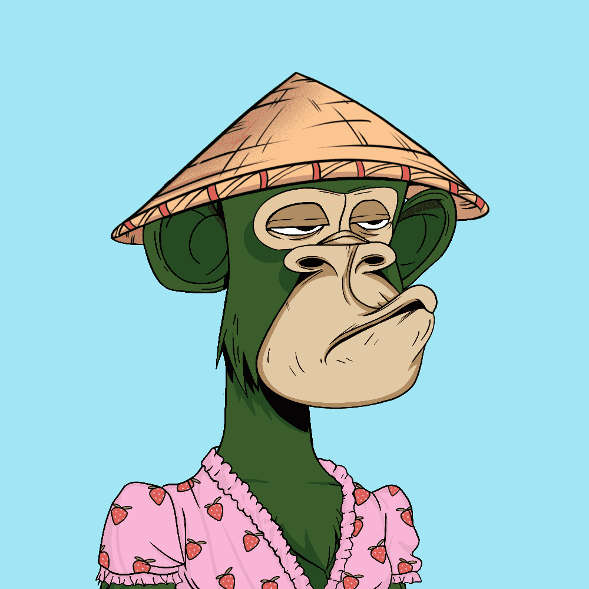

# TiredApeYachtClub

如果继续抽取 BAYC 并且该系列包括额外的 5,000 个供应品怎么办？

TAYC 系列中的嘴巴、表情、帽子和服装不包含在 BAYC 系列中。从未使用过相同的特征。不隶属于 BAYC

欢迎来到累猿游艇俱乐部,PA
TAYC 由以前从未在沼泽 中出现过的猿组成。在 离俱乐部中心稍远的地 方过着最好的生活。欢 迎来到累猿游艇俱乐部
TAYC 系列中的嘴巴、表情、帽子 和服装不包含在 BAYC 系列中。从 未使用过相同的特征。
这些具有完全不同特征的猿类,是 在我们想象如果BAYC继续画下 去,并且该系列包含额外的5000 个补给品会是什么样子时出现的一
个系列?

