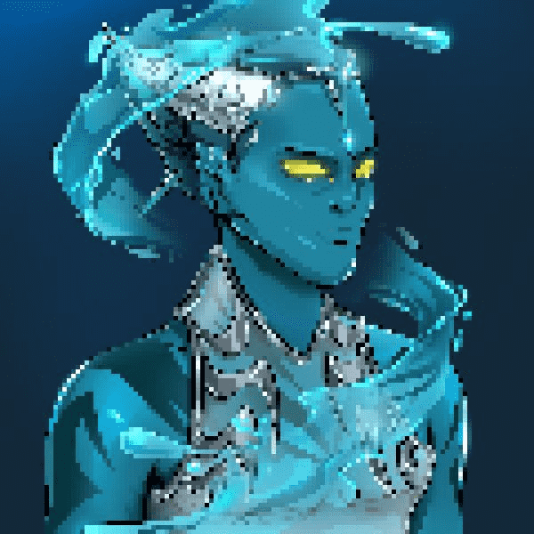

# Titan Clash NFT Official

7,777 种独特的泰坦冲突
Titan Clash 是 7,777 名泰坦的集合，灵感来自希腊神话和奇幻故事，分为 3 个神族。每个 MetaTitan 都基于数百个精心设计的元素，使您的 Titan 独一无二且令人生畏。通过获得 Titan Clash NFT 收藏品，您可以参与开发故事情节、代表您的核心派系、建立一个赚钱的惊人项目等等。
迷失在元宇宙
一千年来，宙斯和他的兄弟哈迪斯一直在战斗。宙斯厌倦了哈迪斯控制他的王国奥林匹亚的策略。由于两个泰坦分别控制着雷电和火元素，战斗是壮观而残酷的，产生了巨大的岩石碎片，落入了他们兄弟位于海底的波塞冬王国。

泰坦在哪里消失了？
一天，一块岩石摧毁了波塞冬巨大金色城堡的一座珍贵塔楼。愤怒的波塞冬浮出水面与他的两个兄弟作战。在最后一次自相残杀的会面中，三名泰坦将他们最强大的元素力量交相辉映，他们爆发了激烈的冲突。在巨大的无声爆炸中被带走，兄弟姐妹消失在另一个维度：元宇宙。

