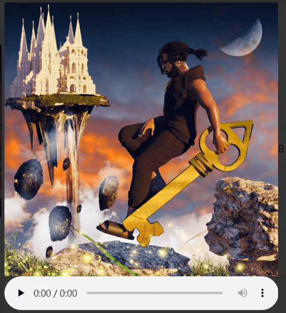

# TK - Music NFT Collection

TK 是加利福尼亚州洛杉矶的歌手、词曲作者、制作人和多乐器演奏家。

TK - 音乐 NFT 收藏统计
创建于 6 个月前
77代币供应
10% 费用
过去 7 天没有售出 TK - Music NFT Collection。

由 TK 在 Sound 上创建！对这首歌发表评论
▶ 什么是 TK - 音乐 NFT 收藏？
TK - Music NFT Collection 是一个 NFT（Non-fungible token）集合。存储在区块链上的数字艺术品集合。
▶ TK - Music NFT Collection 代币有多少？
总共有 77 个 TK - Music NFT Collection NFT。目前，65 位所有者的钱包中至少有一个 TK - Music NFT Collection NTF。
▶ 什么是最昂贵的 TK - Music NFT Collection 销售？
售出的最昂贵的 TK-Music NFT Collection NFT 是 Password #6。它于 2022 年 6 月 24 日（2 个月前）以 109.8 美元的价格售出。
▶ TK - Music NFT Collection 最近卖出了多少？
过去 30 天内售出了 2 个 TK - Music NFT Collection NFT。

