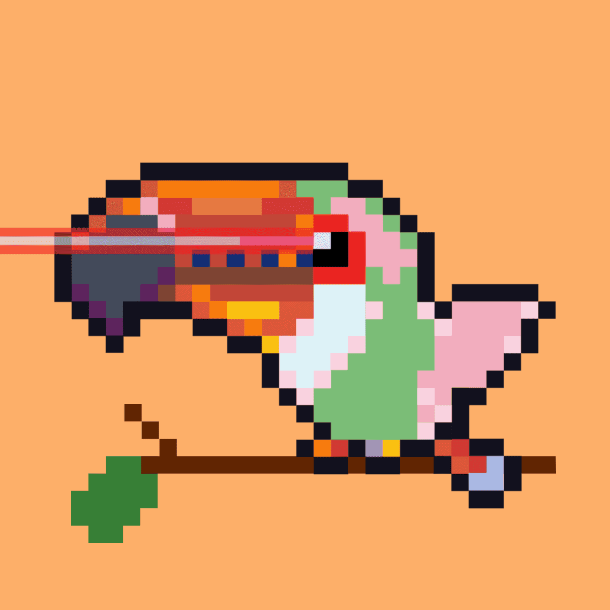

# Tocabo

TocaIsland 是一个多区块链元宇宙岛。TocaIsland 的生态系统主要由 TocaboNFT(Bigmouth bird)🐧、TocaTreeNFT🌴 和 $TocaWorm Token🪱 组成。一个 Tocabo 将在 2022 年第四季度免费获得一块 TocaIsland 土地！
Tocabo 越强大，它在 TocaIsland 的领土就越多。TocaTree 产生 $TocaWorm 代币。Tocabo 吃的 $TocaWorm 越多，它就会变得越强大。TocaboNFT 是 5666 只巨嘴鸟 NFT 的独家 NFT 集合，它是 TocaIsland 的通行证。
TocaTreeNFT 是 5666 多种树 NFT 的独家 NFT 合集。$TocaWorm 代币的总供应量为 1,000,000,000。托卡岛占地 50,000 英亩。

2022 年第一季度团队招聘
1、招募富有创造力和热情的团队成员；2、研究NFT市场；3、项目立项

2022 年第二季度 TocaboNFT TocaTreeNFT $TocaoWorms
1、TocaboNFT 铸币；2、向TocaboNFT持有者空投TocaTreeNFT；3、质押TocaTreeNFT产生$TocaoWorms Token

2022 年第三季度 TocaIsland 分布
1、Stake TocaboNFT并销毁$TocaoWorms Token，增加Tobabo的权重属性；2、Heavier Tocabo 在 TocaIsland 获得更多领土

2022 年第四季度 Omnichain TocaIsland
1、币安智能链、Polygon、Avalanche、Fantom；2、仲裁、索拉纳...

