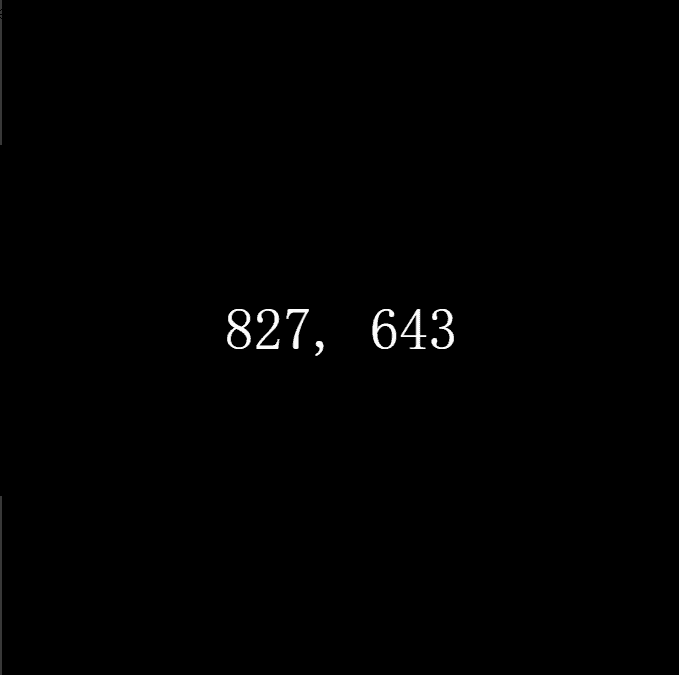

# Token Hash

Token Hash 将链上生成 NFT 中的所有值和变化都从这两个值中派生出来，作为链上生成 NFT。Token Hash 将格式简化为最低限度的表达，提供了一个超越视觉并观察生成系列创造的社会和文化动态的机会。代币哈希从 0 到 999 顺序铸造，总共 1000 个代币。每个图像都在链上渲染并包含两个值；令牌 ID 和确定性生成的随机值。数对的对称性和相似性被评估并作为特征添加到元数据中。更高的值更罕见。对称性评估每个数字内单个数字的重复以及两个数字之间数字的重复。相似性评估两个数字之间的直接关系，它们共享的数字越多，返回的值越高。

通过将令牌 ID 附加到单词 'RANDOM' 并通过 keccak256 哈希函数运行它来获得确定性随机值。输出除以 999，余数显示在令牌 ID 旁边。这种舍入允许探索代币 ID 和哈希之间的关系，并与其他链上生成项目的方法相呼应。

