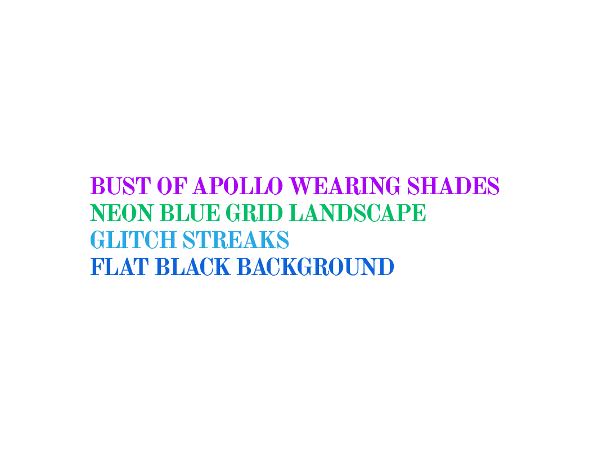

# Tokens Equal Text

彩色 Vaporwave 文本的独特 ERC-998 组合，编码为 ERC-721 令牌 ID。

“Tokens Equal Text”通过一种不可拥有的美学流派批判性地循环了 Rare Art 的所有权驱动。

Tokens Equal Text”由 32 个以太坊 ERC-998 可组合代币组成，每个代币拥有四个子 ERC-721 不可替代代币。ERC-721 令牌具有编码为 ID 号的简短描述性文本。这使得这些文本片段的 ERC-998 令牌组合。如果观众知道令牌 ID 可能被误读为文本而不是数字，则可以解密该合成的内容。

如果观众认识到这些文本片段描述了蒸汽波运动的关键视觉比喻，则可以进一步解密该内容。Vaporwave 是 2000 年代基于互联网的音乐和文化类型，致力于从 1980 年代开始，对穆扎克、数字媚俗美学以及财富和财产的消费主义符号进行采样和讽刺。它作为挪用艺术的地位使其与作为*知识产权*的比喻来源的所有权处于不稳定的关系中。

给定的比喻是否符合 Vaporwave 美学的问题是该流派伴随话语的关键，规范的比喻确立了该美学的内容。对这些规范比喻的文本参考组合至少承认了“这是美学”的问题吗？这是艺术和艺术批评的关键问题，无论是多么歪曲的反映。

使用以太坊 Web3 浏览器应用程序代码，使用“美学”（在 Vaporwave 意义上）排版和颜色在视觉组合中显示令牌文本，从而对该问题的积极回答进行微调，从而解密作品的内容。它还可以防止该内容的恢复只是一个难题。作品内容的轻松恢复突出了奖励沉思的组合和索引结构的存在。

“稀有艺术”市场需要有审美的东西。“Tokens Equal Text”通过引用 Vaporwave 复杂的不可拥有的美学来循环这种愿望，以便满足和挫败它。通过这样做，它将区块链“真正的数字所有权”的焦虑置于与艺术市场的焦虑相互批判审问的状态。

