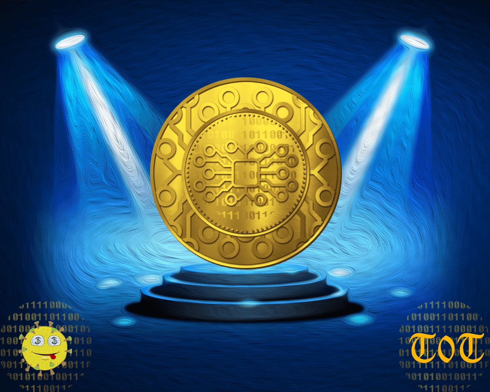

# Tokens of Trust

信任统计的令牌
创建于 6 个月前
100 代币供应
0% 费用
过去 7 天内没有出售任何信任代币。

这些是名为 Contagion 的 p2e 游戏的支持代币（赞助商代币）！！！

请不要尝试直接购买。转到 discord 并阅读有关此令牌的“BT”活动。

不要出售或交易这些！
▶ 什么是信任代币？
信任令牌是一个 NFT（不可替代令牌）集合。存储在区块链上的数字艺术品集合。
▶ 存在多少个 Token of Trust 代币？
总共有 100 个 Trust NFT 代币。目前 4 位所有者的钱包中至少有一个 Trust NTF 代币。
▶ 最近卖出了多少信任代币？
过去 30 天内售出 0 个 Trust NFT 代币。

