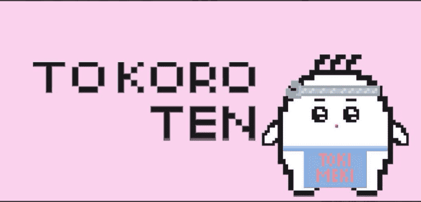

# TOKIMEKI LIFE

时事生活
创建者 10 个月前
10代供电
10% 费用
过去 7 TOKIMEKI LIFE。

“tokimeki”tokoroten tokoroten tokoroten 的意思还是很清楚的。 . 这样一个不为人知的仙女仙子，就是住在TOKIMEKI国度的人。 TOKOROTEN的生活是不洁的。 让我们来看看这位不朽的知性小仙子TOKOROTEN是如何成长和成熟的。

▶ 什么是 TOKIMEKI LIFE？
TOKIMEKI LIFE 是一个 NFT（非同质代币）集合。存储在区块链上的数字艺术品集合。
▶ 有多少 TOKIMEKI LIFE 代币？
总共有 10 个 TOKIMEKI LIFE NFT。目前 6 位所有者的钱包中至少有一个 TOKIMEKI LIFE NTF。
▶ 最近卖出了多少TOKIMEKI LIFE？
在过去 30 天内售出 0 个 TOKIMEKI LIFE NFT。

