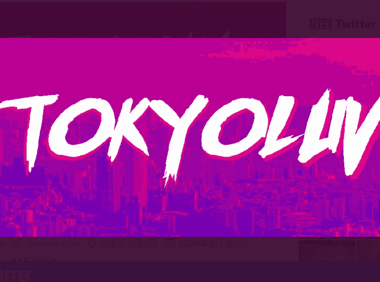

# TOKYOLUV // EDITIONS

TOKYOLUV // 版本统计
创建于 4 个月前
4 代币供应
5% 费用
过去 7 天内没有 TOKYOLUV // 版本售出。

我的版本是根据我自己的智能合约铸造的。

▶ 什么是 TOKYOLUV // EDITIONS？
TOKYOLUV // EDITIONS 是一个 NFT（不可替代代币）集合。存储在区块链上的数字艺术品集合。
▶ 存在多少 TOKYOLUV // EDITIONS 代币？
总共有 4 个 TOKYOLUV // EDITIONS NFT。目前，159 位所有者的钱包中至少有一个 TOKYOLUV // EDITIONS NTF。
▶ 最昂贵的 TOKYOLUV // EDITIONS 促销是什么？
最昂贵的 TOKYOLUV // EDITIONS NFT 是 CRIMSON。它于 2022 年 6 月 7 日（3 个月前）以 181.4 美元的价格售出。
▶ 最近卖出了多少 TOKYOLUV // EDITIONS？
过去 30 天内售出了 2 个 TOKYOLUV // EDITIONS NFT。

