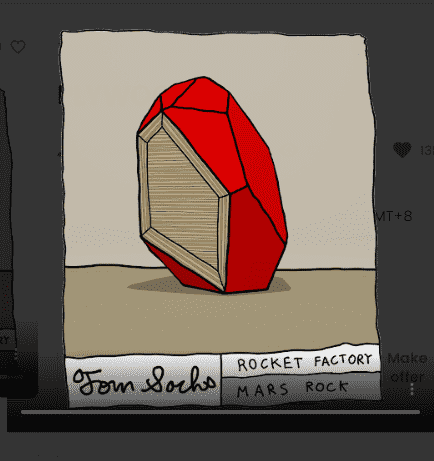

# Tom Sachs: Rocket Factory - Mars Rocks

汤姆萨克斯：火箭工厂 - 火星岩石统计
创建于 3 个月前
15 代币供应
OpenSea 验证集合
10% 费用
10,991 名 Discord 成员
17,861 位推特关注者
Tom Sachs：Rocket Factory - Mars Rocks NFT 在过去 7 天被售出 31 次。Tom Sachs: Rocket Factory - Mars Rocks 的总销售额为 8.03 万美元。Tom Sachs: Rocket Factory - Mars Rocks NFT 的平均价格为 259.1 美元。有 2,170 名 Tom Sachs: Rocket Factory - Mars Rocks 所有者，总共拥有 15 个代币。

链接：https ://linktr.ee/TSRocketfactory

公共铸币厂：2022 年 5 月 31 日。美国东部时间下午 12:00。Mars Rock NFT 将于 2022 年 6 月 1 日公布。

火星岩石是在火星岩石采矿任务期间由火箭工厂人员开采的。Rocket NFT和Test Flight Crew Patch Holders 决定了 Mars Rock NFT 收藏品的最终稀有性，并负责将收藏品带回地球上的我们。

Tom Sachs Rocket Factory 是一个跨维度制造工厂：我们使用 NFT 来构建新的 NFT。在您的 Rocket Factory 机库中获取所有三个组件 - 鼻锥、车身、尾部组件，以铸造一个完整的 Rocket NFT。访问：火箭收藏、组件收藏、补丁收藏和门票收藏

