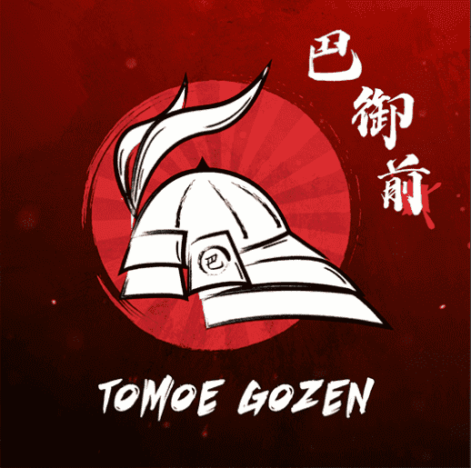

# Tomoe Gozen Official NFT

8000 名女战士灵感来自平家物语和一个名叫 Tomoe Gozen 的女人的传奇故事。

Tomoe Gozen（巴御前）是日本历史上平安时代晚期的一位女武士。她在源平战争期间服务于源义中，并且是导致第一个幕府的冲突的一部分。她的家人与吉中关系密切。

她在《平家物语》中的故事影响了几代武士。Tomoe 经常在书籍、音乐、诗歌、电影、历史小说和一般文化中被颂扬。

平辉
一个惊人的 NFT 集合。
3333名女战士拿起武器，为这个世界而战.Heiki 的故事以 11 世纪初的虚构版本为背景，在日本，权力是唯一真正的必需品。人力创造了一个充满混乱的世界，大多数人都被权力和控制欲所吞噬，他们愿意摧毁任何阻碍他们前进的人。那些贪婪的人每天杀死成千上万的人。

