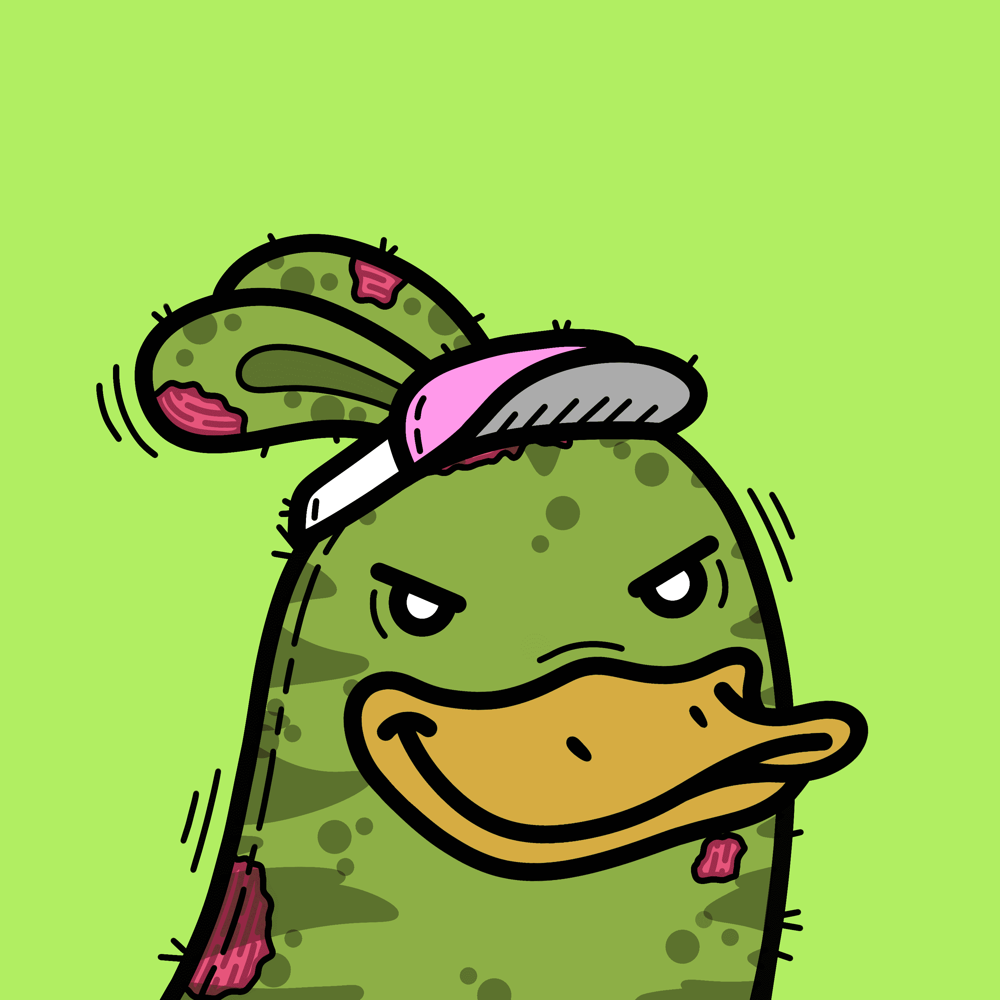

# Toon Town Loons

ToonTown 是一个以社区为中心的 NFT 收藏生态系统，具有从 100 多个手绘特征随机生成的独特且高质量的艺术品。ToonTown 是（元）世界，可收藏的这些生物，即潜鸟，将居住并称之为家。拥有 Genesis Loon 可为您提供独一无二的 PFP，还可以获取月球地图赠品（ETH + NFT）、优先于未来收藏、商品、$Town、Alpha 以及对 ToonTown 故事情节方向的影响。Toon Town 背后的团队是由几个月前聚集在这个荒野空间的几位 NFT 鉴赏家组成的。我们一起经历了这些项目的不同路径，火箭和地毯，被放弃或达不到预期的项目，以及不辜负炒作或完全超出预期的项目。我们相信 NFT 作为一个社区项目的未来，在独特和高质量艺术的基础上建立友谊和建立网络。

