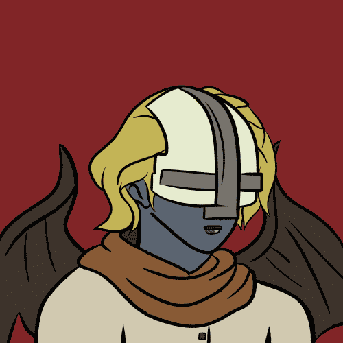

# ToonKnights

卡通骑士统计
创建于 2 个月前
1,072 代币供应
3% 费用
ToonKnights NFT 在过去 7 天内售出 3 次。ToonKnights 的总销售额为 7.52 美元。一个 ToonKnights NFT 的平均价格为 2.5 美元。有 526 名 ToonKnights 所有者，总共拥有 1,072 个代币。

DEGENHUB 推出 5555 名卡通骑士。前 1000 枚免费薄荷糖，每个钱包 2 枚。4500 剩余 0.0035 每个。每个钱包 5 个。55 为团队保留

完全独特且值得信赖的 Degen Mint。没有路线图。没有不和谐。官方推特：https : //twitter.com/degenhub_

▶ 什么是卡通骑士？
ToonKnights 是一个 NFT（不可替代令牌）集合。存储在区块链上的数字艺术品集合。
▶ 有多少 ToonKnights 代币？
总共有 1,072 个 ToonKnights NFT。目前 526 位所有者的钱包中至少有一个 ToonKnights NTF。

