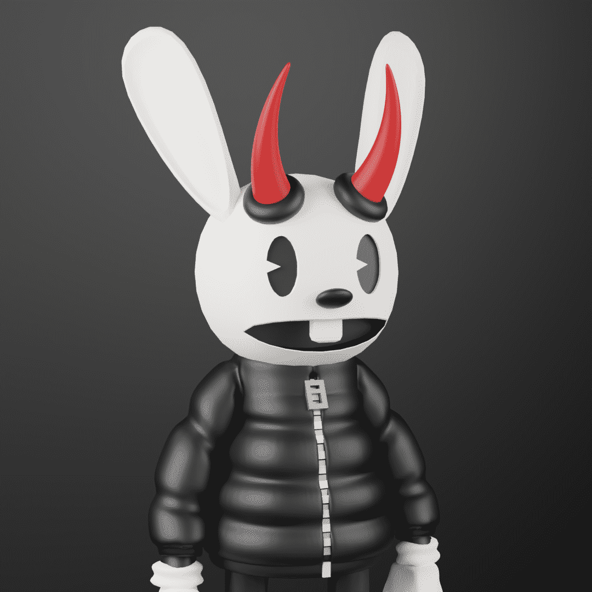

# Toons Official

Toons 官方统计
创建于 4 个月前
4,447 代币供应
OpenSea 验证集合
10% 费用
Toons 官方 NFT 在过去 7 天内售出 41 次。Toons Official 的总销售额为 732.44 美元。Toons Official NFT 的平均价格为 17.9 美元。共有 1,918 名 Toons 官方所有者，总供应量为 4,447 个代币。

由 Illume Studios 推出的社区驱动的收藏项目，基于他们对 1930 年代风格卡通的热爱而打造。包含 4,444 个卡通人物的集合，可让成员访问废土。加入我们的社区：https ://discord.gg/MwEqZc8wpF,Toons Official 是一个 NFT（非同质代币）集合。存储在区块链上的数字艺术品集合。

