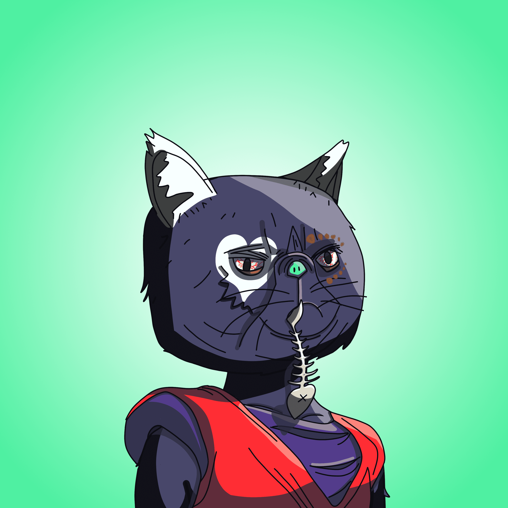

# TopCatBeachClub

顶级猫海滩俱乐部统计
创建于 11 个月前
6,882 代币供应
5% 费用
7,076 名 Discord 成员
Top Cat Beach Club NFT 在过去 7 天内售出 9 次。Top Cat Beach Club 的总销售额为 363.19 美元。Top Cat Beach Club NFT 的平均价格为 40.4 美元。有 2,041 名 Top Cat Beach Club 所有者，总共拥有 6,882 个代币。

新：顶级狗多元宇宙就在这里。Dimenson D-690 为所有 Top Dog 持有者带来免费的艺术升级。Dimenson H-9 将超凡脱俗的怪物带到了海滩俱乐部。在我们的社交网站上获取所有最新信息。

Top Dog Studios 推出 Top Cat 海滩俱乐部！

通过网站访问海滩俱乐部，为您的猫重命名并为其提供背景故事，在我们的游戏区赢取奖品，领取您的 $SNAX 代币，在我们的照相亭拉皮条，访问独家研讨会，并宣誓效忠到顶级猫包。

