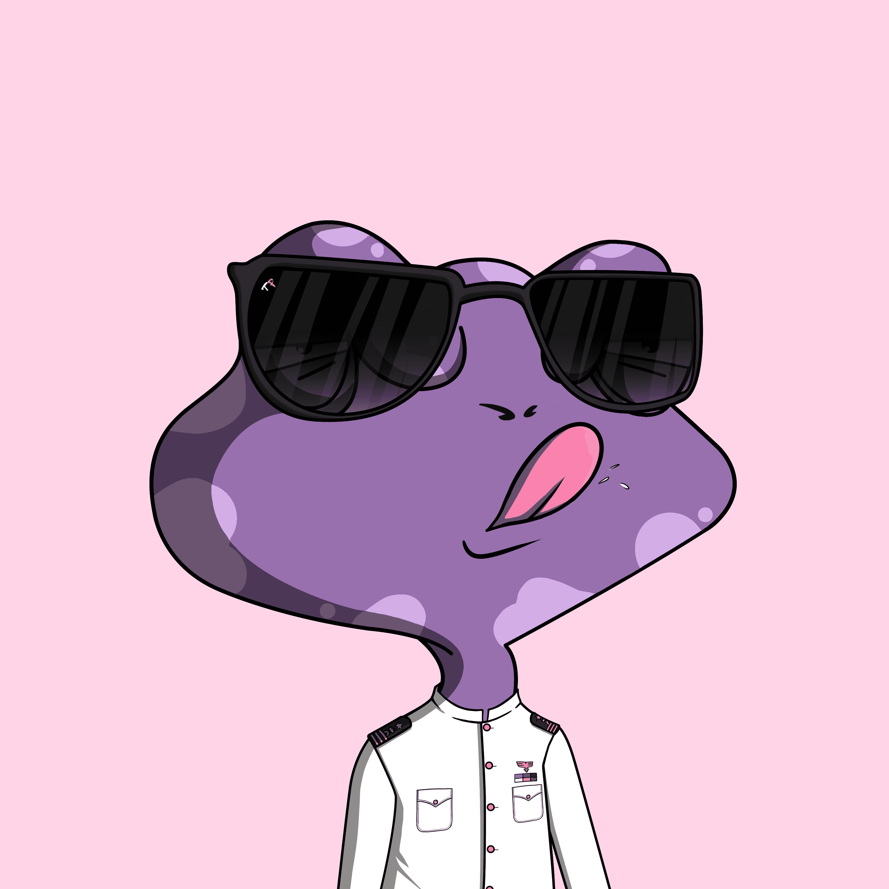

# Top Frogs Genesis

顶级青蛙
Top Frogs 是一个集合，其中包含 +230 种最精美艺术的手绘特征，这些特征生成在 500 个 Genesis Top Frogs 的集合中，它们将在以太坊区块链上生存和呼吸。TF Genesis 是 500 只青蛙的集合，由 230 多种手绘特征组合而成，这些特征将成为以太坊区块链上的知识产权生物。凭借其全面的设计，青蛙的目标是将人们联系在一起，通过独家 NFT 所有权为持有者提供平等的机会。青蛙是关于探索、建设和包容的。在不断发展的网络 3 中，每只青蛙都相当于一个独特的个人品牌。创作者将简单地努力创造，并为社区提供更多机会。总供应量是多少？
总共将组装 500 个完全独特的 Top Frogs NFT，并从 230 多个特征中随机生成。

为什么是顶级青蛙？
青蛙的使命是通过完全拥有 NFT 为其持有者提供长寿、可持续性和未来机会。Top Frogs 将以低廉的价格和节能合同提供，我们的愿景是为每个人提供纯净、清洁的产品。

