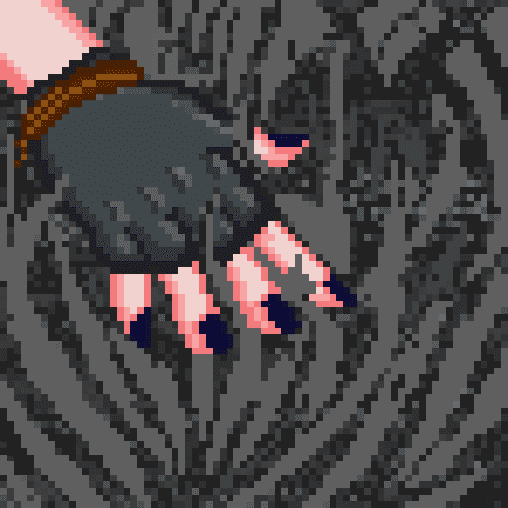

# TouchGrass NFT

触摸草是为那些从不外出并住在父母地下室的人生成的。该项目属于公共领域；随心所欲地触摸草。没有路，只有草。 第一个生成的 Touch Grass NFT。

50% 的版税将捐赠给,

我们必须保护地球上的草，这样我们才能继续触摸它！

薄荷是活的，薄荷价格降低了 0.005 eth！💥

与我们分享您的草和模因，不要忘记#TouchGrass !!! 🫳🌱

Touch Grass 是一个 CC0 NFT。

这意味着什么？

CC0（知识共享 - 无权利保留）使 NFT 可以归他人所有。 CC0 意味着任何人都可以将 NFT 用于商业目的，而无需注明原始艺术家、团队或创作者的归属。

