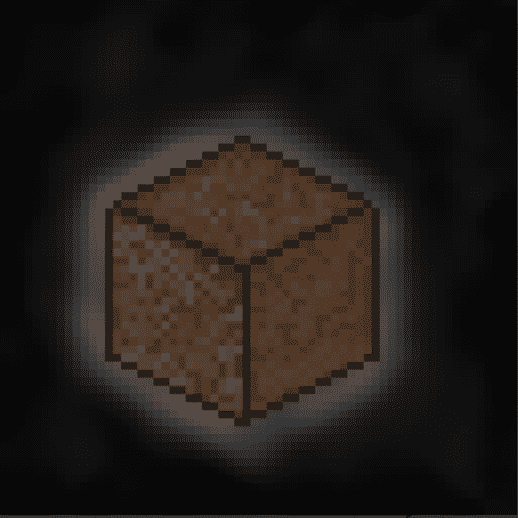

# Touch Pixel Grass

触摸像素草统计
创建于 3 个月前
2,162 代币供应
2.5% 费用
过去 7 天没有售出 Touch Pixel Grass。

5000 块像素化的草地生活在以太坊区块链上，激励人们在这样的时代走出去触摸一些草地，但有些人却不能离开家。这是给你的，30% 的薄荷将捐赠给心理健康慈善机构。

稀有度：3000 泥土、1000 裸草、900 甘美草和 100 金草。
▶ 什么是触控像素草？
Touch Pixel Grass 是一个 NFT（非同质代币）集合。存储在区块链上的数字艺术品集合。
▶ 存在多少个 Touch Pixel Grass 代币？
总共有 2,162 个 Touch Pixel Grass NFT。目前，414 位车主的钱包中至少有一个 Touch Pixel Grass NTF。
▶ 最近卖出了多少Touch Pixel Grass？
过去 30 天内售出 0 个 Touch Pixel Grass NFT。

