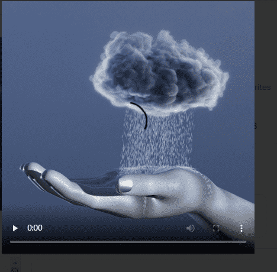

# Touching Sensations

感动的感觉统计
创建于 4 个月前
2 代币供应
10% 费用
Touching Sensations NFT 在过去 7 天内售出 7 次。Touching Sensations 的总销售额为 629.3 美元。一份 Touching Sensations NFT 的平均价格为 89.9 美元。共有 16 位 Touching Sensations 所有者，总共拥有 2 个代币。

探索我们都可能经历过但很难用语言表达的奇怪感觉,
▶ Touching Sensations 代币有多少？
总共有 2 个 Touching Sensations NFT。目前，16 位所有者的钱包中至少有一个 Touching Sensations NTF。
▶ Touching Sensations 最昂贵的促销活动是什么？
售出的最昂贵的 Touching Sensations NFT 是 🌧⚡️。它于 2022-07-01（2 个月前）以 89.9 美元的价格售出。
▶ 最近卖出了多少触感？
过去 30 天内售出了 7 个 Touching Sensations NFT。

