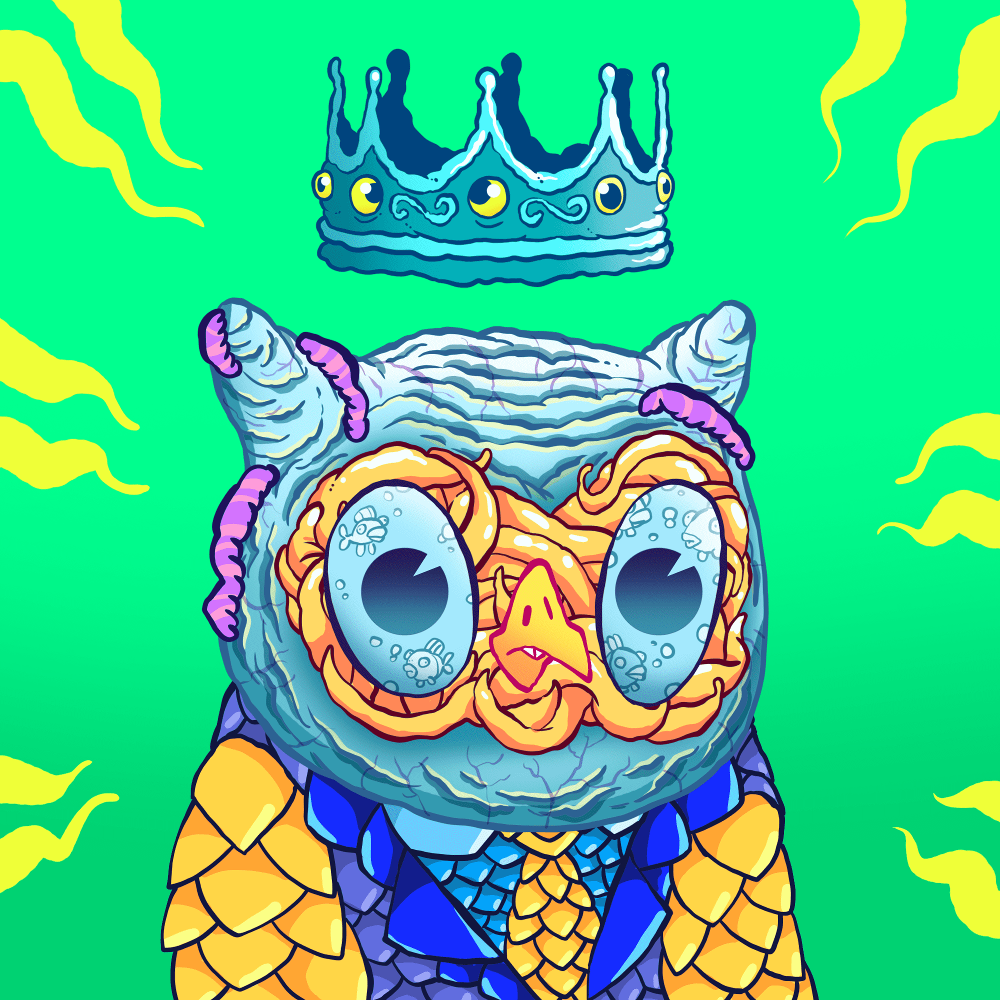

# TOXIC BIRDS OFFICIAL.

毒鸟官方。NFT 在过去 7 天内售出 2 次。TOXIC BIRDS OFFICIAL 的总销量。是 4.94 美元。一只TOXIC BIRDS OFFICIAL的平均价格。NFT 是 2.5 美元。官方共有 383 只毒鸟。所有者，拥有 1,111 个代币的总供应量。

只有一个真正的收藏！TOXIC BIRDS OFFICIAL 是存储在以太坊区块链上的 3,333 个独特 ERC-721A 代币的 NFT 集合。每个 NFT 都包含 120 多种手绘设计和独家特征，以提供令人惊叹的卓越品质系列。
▶ 多少毒鸟官方。代币存在吗？
总共有 1,111 只毒鸟官方。NFT。目前，383 位业主拥有至少一名 TOXIC BIRDS OFFICIAL。NTF 在他们的钱包里。
▶ 什么是最昂贵的 TOXIC BIRDS OFFICIAL。销售？
最昂贵的毒鸟官方。出售的 NFT 是 TOXIC BIRDS #490。它于 2022-06-08（3 个月前）以 913 美元的价格售出。
▶ 多少毒鸟官方。最近有卖吗？
官方共有 33 只毒鸟。过去 30 天内售出的 NFT。

