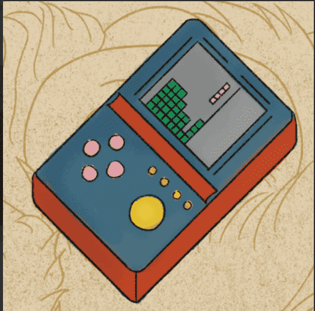

# Toy from Memory

来自内存统计的玩具
创建于 3 个月前
999 代币供应
0% 费用
过去 7 天内没有售出记忆中的玩具。

999个我记忆中最喜欢的玩具，都是手绘的。也一定是你的回忆。现在铸币，今天揭晓。
▶ 什么是记忆玩具？
Toy from Memory 是一个 NFT（非同质代币）集合。存储在区块链上的数字艺术品集合。
▶ 记忆中的玩具代币有多少？
总共有 999 个来自 Memory NFT 的玩具。目前，318 位车主的钱包中至少有一件来自 Memory NTF 的玩具。
▶ 记忆中的玩具最近卖了多少？
在过去 30 天内售出了 0 个来自 Memory NFT 的玩具。

