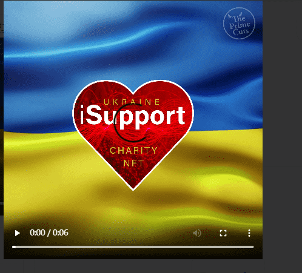

# The Prime Cuts - Ukraine Fundraiser

Prime Cuts - 乌克兰筹款活动统计数据
创建于 6 个月前
1,000 代币供应
10% 费用
过去 7 天没有出售 The Prime Cuts - 乌克兰筹款活动。
▶ 什么是 Prime Cuts - 乌克兰筹款活动？
Prime Cuts - 乌克兰筹款活动是一个 NFT（非同质代币）集合。存储在区块链上的数字艺术品集合。
▶ 有多少 The Prime Cuts - 乌克兰筹款活动代币？
总共有 1,000 个 The Prime Cuts - 乌克兰筹款 NFT。目前，6 位所有者的钱包中至少有一份 The Prime Cuts - 乌克兰筹款活动 NTF。
▶ 最近卖出了多少 The Prime Cuts - 乌克兰筹款活动？
过去 30 天内共售出 0 个 The Prime Cuts - 乌克兰筹款活动 NFT。

