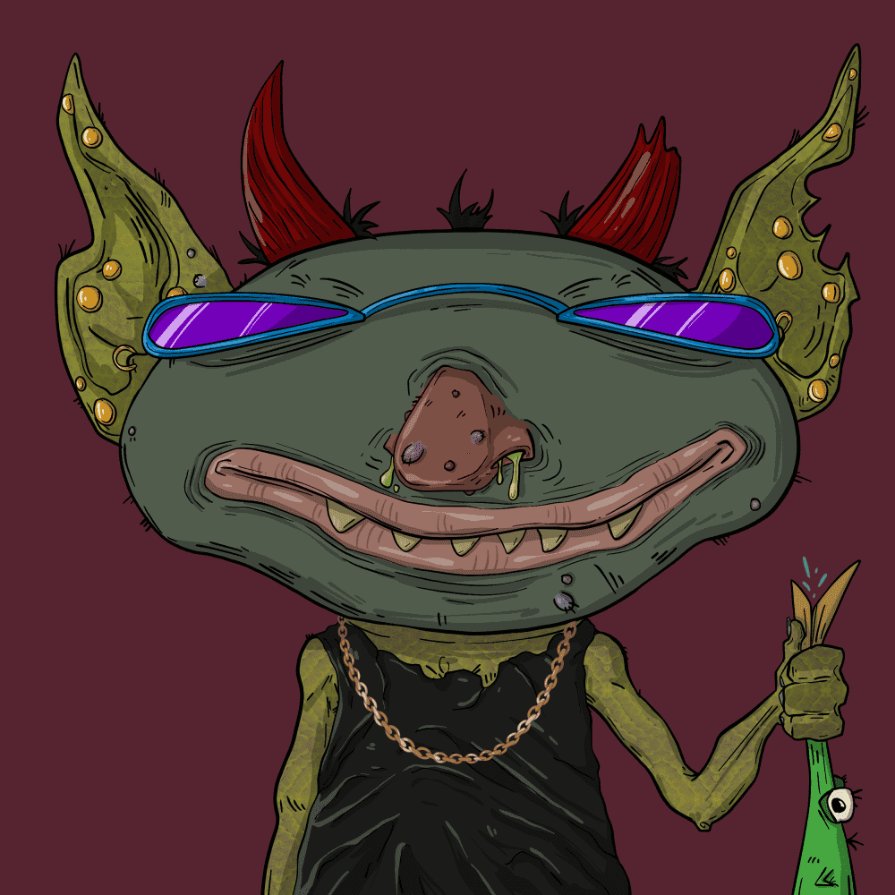

# Trash Kingz

cc0 下构建的所有 ziz 10000 个病态污垢 NFT 中的 kingZ #fortheculture

1 件免费薄荷糖给每个人

二等奖生病便宜 0.0055

垃圾盘线来了

▶ 什么是垃圾王？
Trash Kingz 是一个 NFT（非同质代币）集合。存储在区块链上的数字艺术品集合。
▶ 有多少 Trash Kingz 代币？
总共有 10,000 个 Trash Kingz NFT。目前，4,627 位车主的钱包中至少有一个 Trash Kingz NTF。
▶ 最昂贵的 Trash Kingz 销售是什么？
售出的最昂贵的 Trash Kingz NFT 是 Trash Kings #723。它于 2022-06-08（3 个月前）以 41.7 美元的价格售出。
▶ 最近卖出了多少 Trash Kingz？
过去 30 天内售出了 287 个 Trash Kingz NFT。
▶ Trash Kingz 的价格是多少？
过去 30 天，最便宜的 Trash Kingz NFT 销售额低于 3 美元，最高销售额超过 14 美元。过去 30 天内，Trash Kingz NFT 的中位价格为 5 美元。

