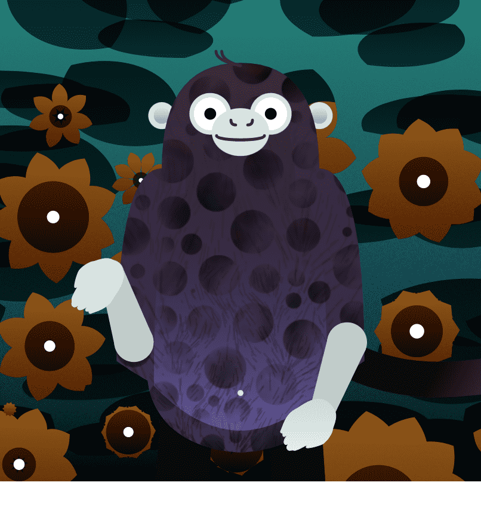

# Trash Pandas of the World

垃圾熊猫是聪明的生物，它们住在树篱里，晚上在垃圾桶里打猎。他们最喜欢的零食是鱼骨，但他们会很高兴戴上一顶漂亮的帽子。它们是群居动物，尽管世界上已知的垃圾熊猫只有 8,888 只。
世界 NFT 的垃圾熊猫 - 常见问题（FAQ）
▶ 什么是世界垃圾熊猫？
Trash Pandas of the World 是一个 NFT（Non-fungible token）集合。存储在区块链上的数字艺术品集合。
▶ 世界垃圾熊猫代币有多少？
全球 NFT 共有 5,897 只垃圾熊猫。目前，1,142 位所有者的钱包中至少有一只世界 NTF 垃圾熊猫。
▶ 最近卖出了多少世界垃圾熊猫？
过去 30 天内售出 0 个世界 NFT 垃圾熊猫。

