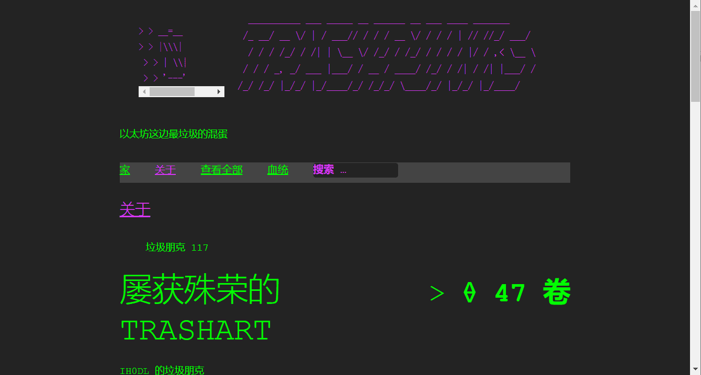

# TRASHPUNKS V2

关于 iH0DL
iH0DL 是一位 34 岁的美国加密艺术家，专注于数据安全、金融自由，最重要的是创造自由。“i”是一名战斗老兵，他开始创作艺术来帮助他的心理健康之旅。这是他在加密艺术领域的第一年，销售额超过 Ξ 100。iH0DL 还计划推出一个专门针对艺术家的 DAO，一个 0 费用的市场。在Twitter上取得联系或提交请求。
这个集合开始于 Opensea Shared Storefront 合同，后来迁移到 ERC-721 标准。Opensea Shared Storefront 版本现在可以更换为每个朋克的官方代币。有关TRASHPUNKS网站的更多信息。第一代（1-167）至少两个 TRASHPUNKS 的持有者将收到他们的 TRASHPUNKS 产生的后代的空投。垃圾朋克是一种艺术模仿。由 iH0DL 创建 每个垃圾朋克都将使用数字技术（很可能是生育技术）手动丢弃，以使这些小混蛋成为城里最垃圾的朋克。

