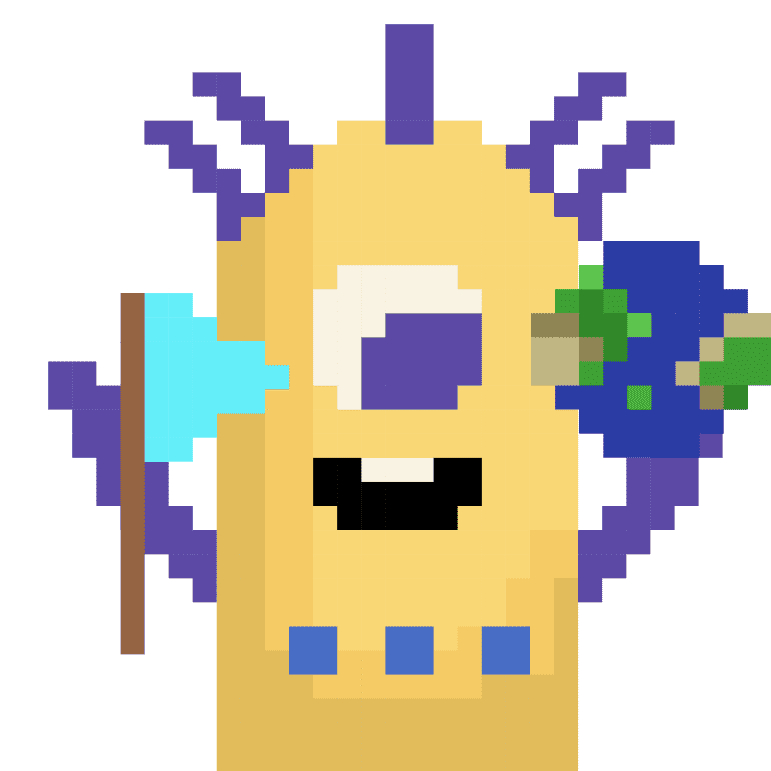

# Traveloggers

在遥远的银河系，一场革命导致了一场远离家乡的旅程。物质宇宙诞生了。
Traveloggers 拥有 Matters Lab 发布的 1,500 个数字化身，通过允许 NFT 的每个后续所有者记录一条消息，通过集体创作来扩大私人所有权。这些化身的拥有者将可以访问 Matterverse 中最具革命性的实验。
Matterverse 诞生于 Matters 社区的共同创建。自 2018 年成立以来，Matters 已发展到超过 80,000 名作者，是 Web3 世界中最大的创作者社区。

2021 年 10 月，Matterverse 社区的 100 多名成员通过共同创作 Matterverse 的系列起源故事来汇集他们的创意：银河宇宙面临哪些挑战？Matterverse为什么会出现？这些人如何克服挑战并创造新的范式？我们将在物质宇宙中走向何方？故事还在继续。

