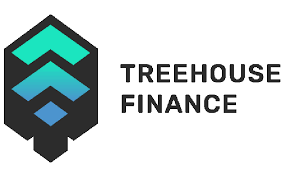

# TreehouseFinance

有关完整描述，您可以找到我们的 gitbook为 DeFi 用户提供数据、分析和风险管理解决方案......在*Treehouse*，我们正在构建授权 DeFi 用户和....利用定量数据和分析来构建风险管理产品和 DeFi 中最全面的仪表板。在当今的传统*金融* ...*Treehouse*是一家 Web3 公司，将链上数据转化为有意义的指标，以帮助去中心化*金融*(DeFi) 投资者做出明智的*金融* ...全面的 DeFi 投资组合分析平台！在这里找到我们：http://linktr.ee/TreehouseFi。元宇宙收获。*树屋*。*金融*2021 年 3 月加入。*Treehouse Finance*为数字资产用户提供其头寸的分析和风险指标。我们正在构建一个用户友好的平台，以帮助用户...

