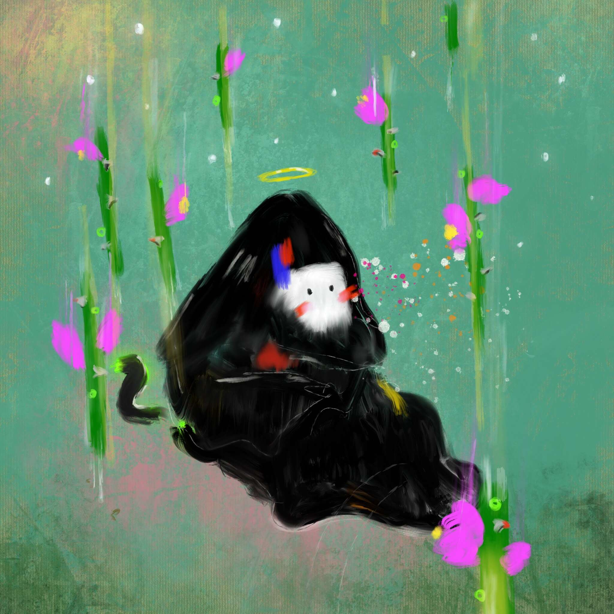

# TRICKERZ WORLD

经过 
骗子
我在 2022 年父亲节创作了这幅作品，无意让它代表任何与损失有关的内容。虽然回首过去，这与我的悲痛息息相关……我在 2020 年 2 月开始时完全出乎意料地失去了我的父亲，没有详细说明，正如人们所预料的那样，我的生活发生了翻天覆地的变化。我从没想过要铸造这个，但我感到一种拉力，这告诉我我需要在链上巩固它。对我来说，这代表了我顽皮的精神和好奇心的一部分，柔和的色彩和花卉意象，实验性的笔触捕捉到了某种纯真，但也被一个隐蔽的、隐蔽的人物所限制和深切传达。看起来好像一切都在沉没在水下，或者向上飞到未知的地方，而对象仍然静止。

