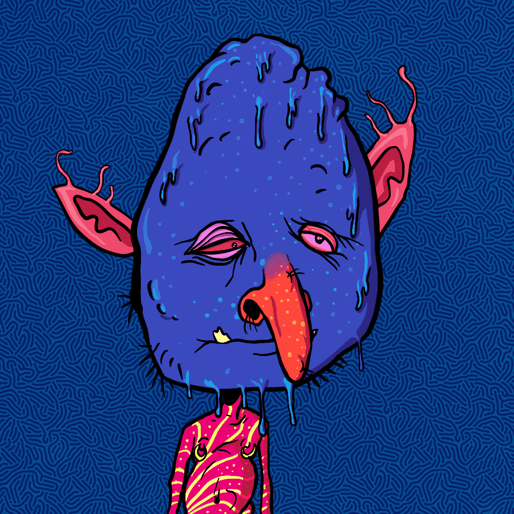

# trippingoblin.wtf

trippingoblin.wtf NFT - 常见问题（FAQ）
▶ 什么是 trippingoblin.wtf？
trippingoblin.wtf 是一个 NFT（不可替代令牌）集合。存储在区块链上的数字艺术品集合。
▶ 存在多少个 trippingoblin.wtf 代币？
总共有 689 个 trippingoblin.wtf NFT。目前 275 位所有者的钱包中至少有一个 trippingoblin.wtf NTF。
▶ 最昂贵的 trippingoblin.wtf 销售是什么？
出售的最昂贵的 trippingoblin.wtf NFT 是 trippingoblin.wtf #1003。它于 2022 年 6 月 20 日（2 个月前）以 22 美元的价格售出。
▶ 最近卖出了多少个 trippingoblin.wtf？
过去 30 天内售出了 11 个 trippingoblin.wtf NFT。
▶ trippingoblin.wtf 需要多少钱？
在过去 30 天内，最便宜的 trippingoblin.wtf NFT 销售额低于 2 美元，最高销售额超过 19 美元。在过去 30 天内，trippingoblin.wtf NFT 的中位价格为 5 美元。
▶ 什么是流行的 trippingoblin.wtf 替代品？
许多拥有 trippingoblin.wtf NFT 的用户还拥有 Manga Baby Azuki、 Fzuki-Official、 House of Clownz和 Trolltown Mutational Elixirs。

