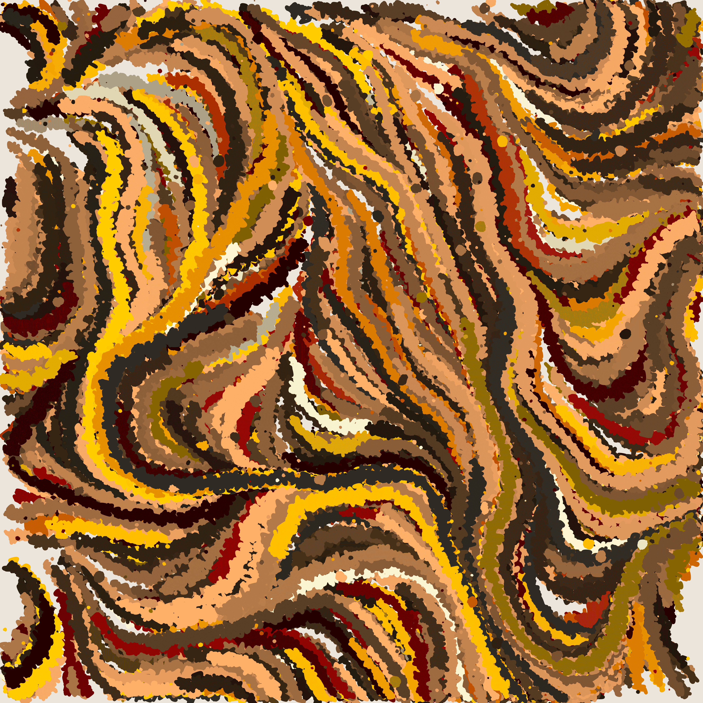

# Trippy Strokes

什么是艺术铸造？
Art Foundry在以太坊区块链上制作实验性的生成艺术。L3xc (Lim) 是一位软件工程师、设计师和生成艺术家，他创立了 Art Foundry 来记录他创建实验性生成艺术 NFT 的旅程。

这是链上生成艺术吗？
我们的一些版本是链上的（例如，Happy Accident）。一些需要来自其他来源（例如 Pukenza）的颜色说明的版本是预先生成的，而不是链上的。

未来的薄荷糖和薄荷通行证？
如果您持有 Mint Pass (Linea Forma)，那么您将能够免费铸造即将发布的 Art Foundry（+ gas）。

它的工作原理类似于同伴掉落。1 个代币 = 1 个可铸币。可铸件将与您的铸币通证共享相同的令牌 ID，因此不需要快照。

我需要多长时间才能认领我的作品？
索赔窗口将永远开放2 周。

如果我没有薄荷通行证，是否会公开发售即将到来的掉落？
是的。除了为薄荷通行证持有者保留的代币（代币 ID #0 - #127）外，其余代币（例如 Happy Accident，代币 ID #128 - #255）都可以以上市价格进行许可/公开销售。

