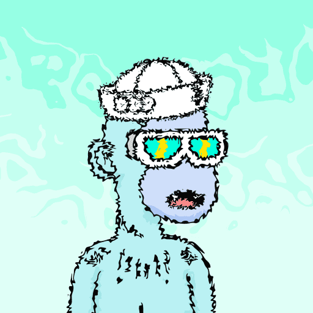

# Trippy3Landers

5,555 名 Trippy3Landers 生活在不断的旅行中，前 2,555 名免费，之后免费 0.0055 ETH。20 每笔交易。ERC721A 气体优化项目。

捐赠该项目所有利润的 20% 以支持乌克兰。拿出 10% 的利润购买 3Landers 并将它们赠送给我们的幻影持有者。

请记住，我们的项目是 ERC721A GAS OPTIMIZED PROJECT，所以事情进展得非常快，minting 1 与 minting 20 的 gas 相同，不要困了  。

我们的 Trippy3Landers 项目首先是对 3Landers 的致敬，之后我们是一个社区 - 我们想要建立并相信我们可以建立一个强大的社区，它将成为每个人的家 - Stoners ，Artists ，Developers，游戏玩家，书呆子，甚至婴儿潮一代（操他们，他们没有表情符号）。

不隶属于任何项目。

