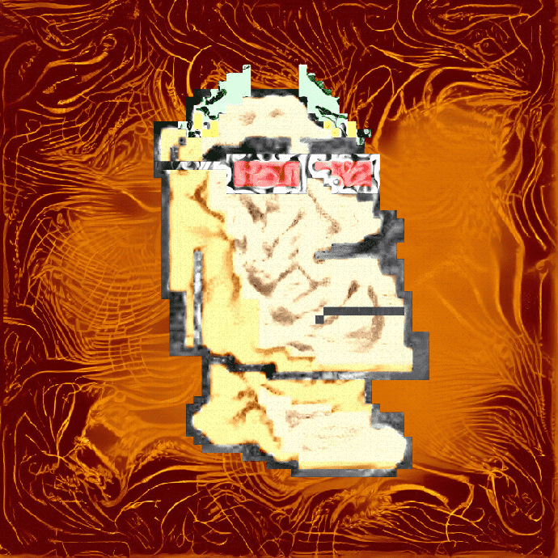

# TrippyMoais

TrippyMoAI 是在以太坊区块链上绊倒的 69x69 Moai Heads。MoAI 是由人工智能 (AI) 软件创建的。（不）幸运的是，我们的 AI 在创建我们的 MoAI 之前就被喂了 200 毫克的魔法蘑菇。现在我们有 3.300 个 TrippyMoAI，它们在魔法蘑菇上的表现和他妈的一样高，并且永远在元宇宙中绊倒，直到时代结束！现在加入我们的运动，向世界展示你是一个真正的绊脚石！
经过 
莱昂纳多·拉马斯
一个超级智能 AI 在一些蘑菇上进行了一次旅行，并开始改变这些 Moai 雕像。AI 决定将 Moais 上传到以太坊区块链，它们现在被永久存储在那里。Trippy Moais 现在生活在元宇宙中。

