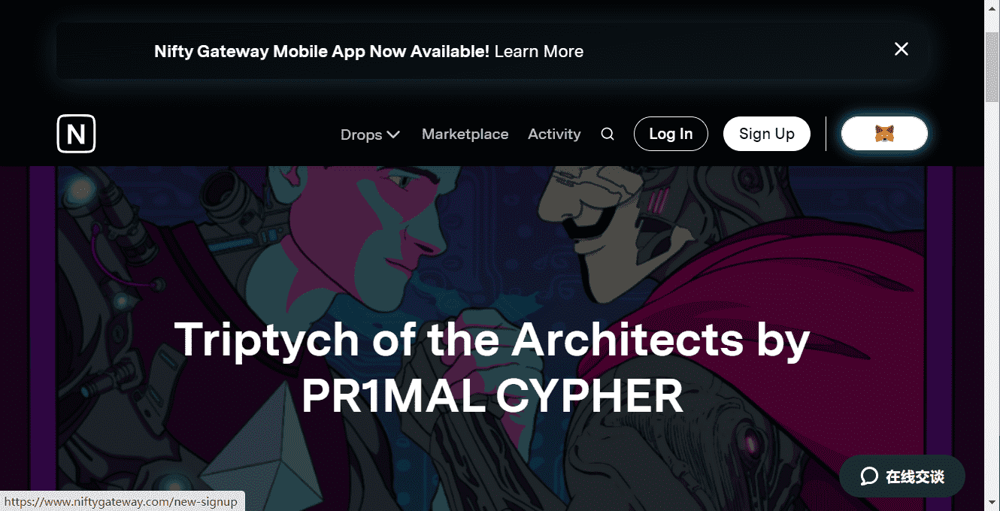

# Triptych of the Architects by PR1MAL CYPHER

加密艺术家 PR1MAL CYPHER 在 Nifty Gateway 上发布包系列！
PR1MAL CYPHER 在因斯布鲁克和维也纳学习哲学、语言学、精神分析和艺术。过去他的艺术作品主要在油画领域。2020 年初，他彻底改造了自己，将自己的工作主要投入到数字领域，尤其是加密艺术和 NFT 领域，他在其中迅速蓬勃发展并获得了更广泛的认可。PR1MAL CYPHER 诞生了。他的作品很大程度上受到了 Vaporwave 和 Outrun 艺术的启发，因为他从年轻时就对 CYBERPUNK 充满热情。他看到的不仅仅是优雅的美学。赛博朋克的意义远不止于此 - 一座桥梁，将当前及其技术创新和雄心与人类未来的不同场景联系起来，这将受到技术的重大影响。

