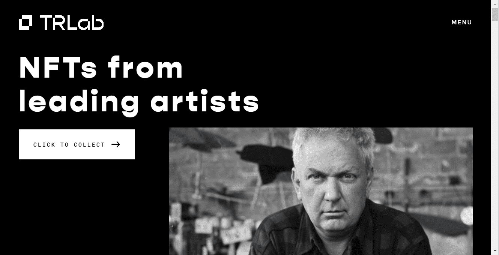

# TR Lab X AI 2041 Collector Cards

在TRLab，我们的使命是开创一种概念化和收集美术的新方法。凭借来自主要艺术收藏家、科技企业家和天使投资人的财团的420 万美元额外资金，我们正在进入 TRLab 的 NFT 平台和社区的加速增长阶段。当我们庆祝这个重要的里程碑时，现在是提醒我们自己和我们的成员的好时机，这个旅程都是从一个简单的短语开始的：如果？

2021 年初，随着全球对 NFT 的兴趣激增，我们问自己：如果我们可以建立一个制作工作室和平台，支持数字和传统艺术家将 NFT 融入他们的艺术实践中，那会怎样？如果我们可以邀请收藏家与这些艺术家一起进入一个独特的虚拟社区，并将收藏行为建立在访问、参与和对艺术的共同热爱中呢？如果我们——作为所谓的“传统”艺术世界的资深人士——能够为艺术家、基金会、博物馆和知名艺术收藏家揭开 NFT 的神秘面纱，并帮助弥合模拟艺术世界和加密原生市场之间的鸿沟，那会怎样？如果我们——作为植根于亚洲的世界公民——能够无缝地庆祝东西方艺术传统，并创建一个真正的全球 NFT 艺术平台呢？

