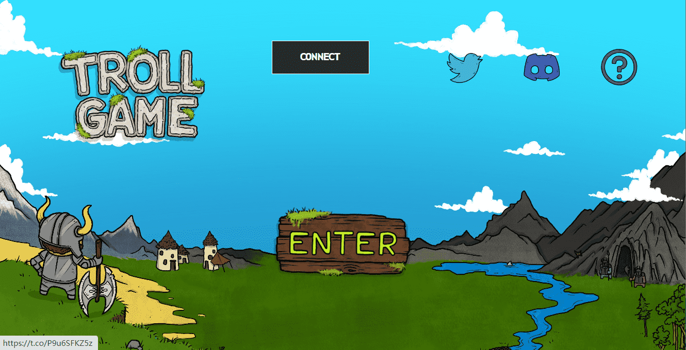

# Troll Game Casino

巨魔游戏赌场统计
创建于 7 个月前
500 代币供应
10% 费用
Troll Game Casino NFT 在过去 7 天内售出 3 次。Troll Game Casino 的总销售额为 27.12 美元。Troll Game Casino NFT 的平均价格为 9 美元。有 257 位 Troll Game Casino 所有者，总共拥有 500 个代币。

赚到的钱是赚到的钱的两倍。
Troll Game Casino NFT - 常见问题（FAQ）
▶ 什么是巨魔游戏赌场？
Troll Game Casino 是一个 NFT（非同质代币）系列。存储在区块链上的数字艺术品集合。
▶ 存在多少 Troll Game Casino 代币？
总共有 500 个 Troll Game Casino NFT。目前，257 位所有者的钱包中至少有一个 Troll Game Casino NTF。
▶ Troll Game Casino 最昂贵的交易是什么？
售出的最昂贵的 Troll Game Casino NFT 是 Troll Casino#225。它于 2022-06-12（3 个月前）以 21.4 美元的价格售出。
▶ 最近售出了多少 Troll Game Casino？
过去 30 天内售出了 6 个 Troll Game Casino NFT。
▶ 什么是流行的巨魔游戏赌场替代品？
许多拥有 Troll Game Casino NFT 的用户还拥有 Troll Game Lands Official、 Troll Game: Loot Crate、 Troll Game Weapon和 Troll Game Invitation。

