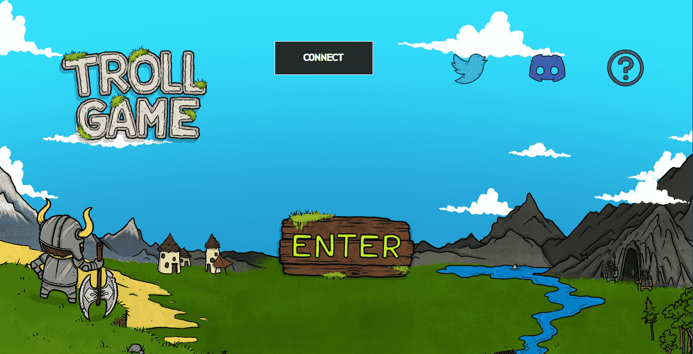

# Troll Game: Lands

Troll Game Lands 官方统计
创建于 7 个月前
2,500 代币供应
10% 费用
Troll Game Lands 官方 NFT 在过去 7 天内售出 5 次。Troll Game Lands Official 的总销售额为 40.33 美元。一款 Troll Game Lands Official NFT 的平均价格为 8.1 美元。有 577 名 Troll Game Lands 官方所有者，拥有总供应量 2,500 个代币。

只要敢于梦想，就可以占领新的土地
巨魔游戏登陆官方 NFT - 常见问题（FAQ）
▶ 什么是 Troll Game Lands 官方？
Troll Game Lands Official 是一个 NFT（不可替代代币）集合。存储在区块链上的数字艺术品集合。
▶ 存在多少 Troll Game Lands 官方代币？
总共有 2,500 个 Troll Game Lands 官方 NFT。目前，577 位所有者的钱包中至少有一个 Troll Game Lands Official NTF。
▶ 最昂贵的 Troll Game Lands 官方特卖是什么？
Troll Game Lands Official NFT 售出的最昂贵的价格是 . 它于 2022-06-14（3 个月前）以 23.5 美元的价格售出。
▶ 最近售出了多少 Troll Game Lands Official？
过去 30 天内售出了 29 个 Troll Game Lands 官方 NFT。
▶ Troll Game Lands Official 的费用是多少？
过去 30 天，最便宜的 Troll Game Lands 官方 NFT 销售额低于 8 美元，最高销售额超过 18 美元。过去 30 天内，Troll Game Lands Official NFT 的中位价格为 11 美元。
▶ 什么是流行的 Troll Game Lands Official 替代品？
许多拥有 Troll Game Lands Official NFT 的用户还拥有 Troll Game - Chapter One、 Troll Game Casino、 Troll Game Mines和 Troll Game: Forges。

