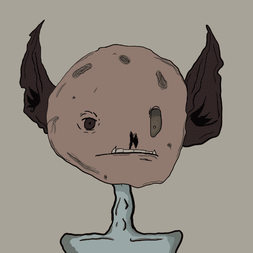

# trollcave.wtf

trollcave.wtf 统计
创建于 3 个月前
5,648 代币供应
5% 费用
过去 7 天内没有售出 trollcave.wtf。

第5648章
trollcave.wtf NFT - 常见问题（FAQ）
▶ 什么是 trollcave.wtf？
trollcave.wtf 是一个 NFT (Non-fungible token) 集合。存储在区块链上的数字艺术品集合。
▶ 有多少个 trollcave.wtf 代币？
总共有 5,648 个 trollcave.wtf NFT。目前，2,452 位所有者的钱包中至少有一个 trollcave.wtf NTF。
▶ 最近卖出了多少个 trollcave.wtf？
过去 30 天内售出 0 个 trollcave.wtf NFT。
▶ 有哪些流行的 trollcave.wtf 替代品？
许多拥有 trollcave.wtf NFT 的用户还拥有 Alpha Fox Gang、 Creature Culture Collection、 单色 | 卡齐米尔·马列维奇和 熟悉的记忆：第一章。

