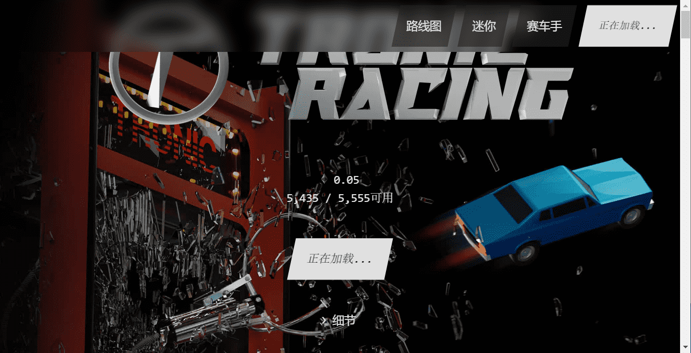

# Tronic Mini Racers

5,555 名 3D 赛车手
Tronic Racing 是 5,555 辆独特的 3D 赛车的集合，准备好在元宇宙中比赛。每辆车都是独一无二的，有自己的风格、油漆颜色和 50 多个改装件。
在 OpenSea 和 LooksRare 上完全可驱动
直接在 OpenSea 和 LooksRare 上试驾您的赛车。在实时 3D 环境中穿越我们的测试赛道。

模组
我们设计了超过 50 种 MODS、油漆颜色和车身样式，创造了超过 1,000,000 种可能性，但仅提供 5,555 种（包括 1/1 特别版）

迷你赛车手
100 名限量版迷你赛车手和您的薄荷通行证给 Tronic Racers。艺术品许可 CC0。

MOGO — 完好无损。铸造时
获得额外的免费Tronic Racer。

在白名单和公开发售之前，首先在 Line
Mint 中。

