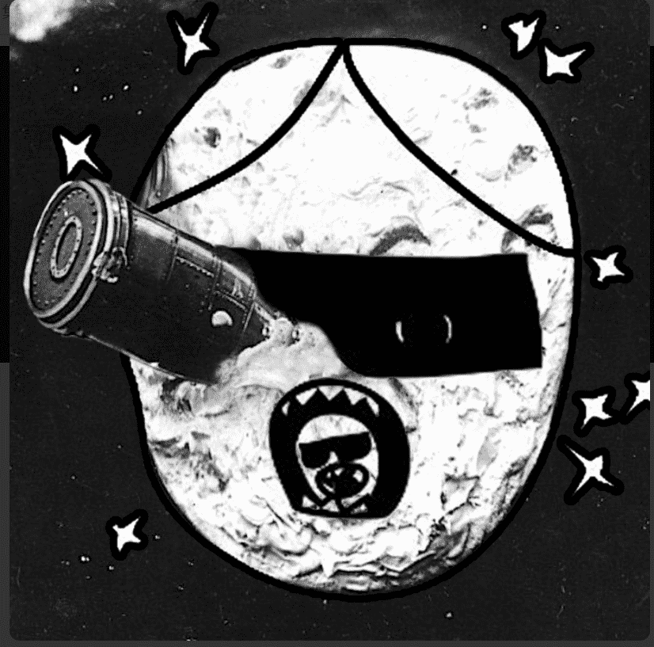

# Thursday Special Edition

这是星期一晚上集合
在收藏的起源，有一个观察：cryptoart 是一种艺术运动，但几乎没有人从美学角度评论它。关于 NFT 的技术、经济和营销维度的论述自相矛盾地为艺术批评本身留下了很少的空间。每天都有数百件艺术品（垃圾艺术、模因、生成艺术、故障、数字绘画、循环、动画等）被制作出来，而我们可能还没有学会看它们。

It's Monday Night 评论是对加密艺术世界的任意哲学探索。每周一次，我会选择一位艺术家或一件挑战我的作品，并尝试解读其意义。每一个IMN都反映了君教授的主观眼光，同时试图将作品的思想严谨地转化为文字。

IMN 既是原创作品，也是档案。这是一个可以是诗意的、形而上学的、政治的、历史的或所有这些的文本：君教授的艺术白日梦在区块链中铸就了永恒。 IMN 已被标记为视频。每个视频都由一种算法生成，该算法在评论发布时读取并实时输入。写作流程、错别字和停顿是不确定计算的，这会导致创建一个独特的资产。

将只有 50 个 IMN。每周一次，为期一年。该集合将是 2020 年代初期 NFT 空间的部分地图。这也将是一位美学教授进入未知领域的旅程：本世纪最伟大的艺术革命。对过去和未来的艺术家、收藏家和博物馆的 50 条评论。 50 条评论将证明艺术在数字时代的创造力。

