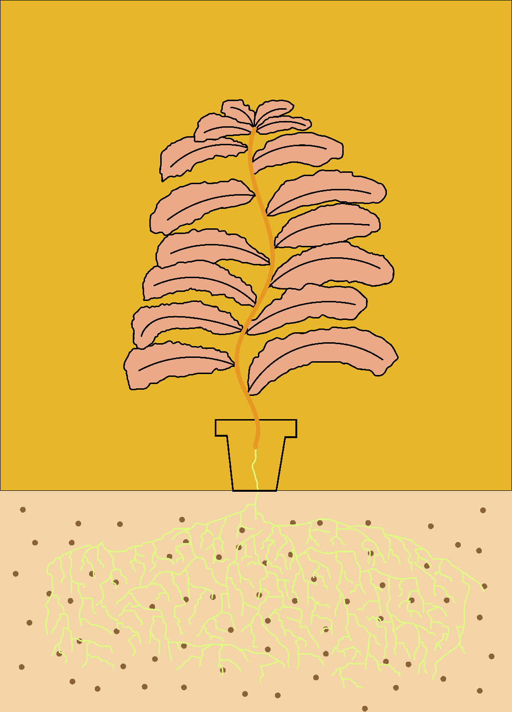

# The Tobacco Producers' Club OFFICIAL

烟草生产者俱乐部

在以太坊区块链上生产植物。您的烟草厂是您进入 TPClub 的入场券——该社区将为烟草业的吸烟者提供服务

以太坊。  

给自己买你的植物成为股东，10K 种独特的烟草植物的集合。

1000 PLANTS 的预售将于 3 月 1 日开始，仅在 opensea.io 上以固定的 0.044ETH 进行预售。

 剩余的 9K 将在 4 月 1 日之后出售。

 每株烟草植物都有来自一百万种可能组合的独特性状，包括叶子、根、土壤、花等等。有些特征极为罕见，而另一些则相当普遍。

