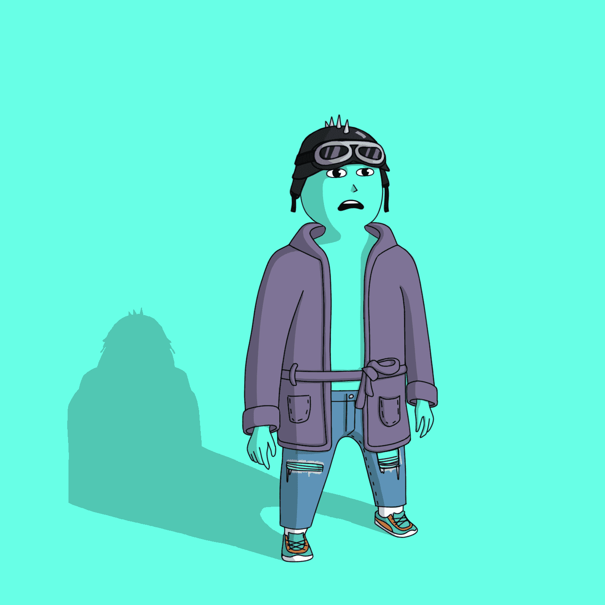

# TubzSocialClub V2

TubzSocialClub 是一个反映我们价值观的项目，我们相信这将根据自己的价值观（即以自我提升为中心）改善我们志同道合的社区中的人们的生活。我们的目标是通过创建世界上第一个提供自我开发/心理健康实用程序的 NFT 项目来使我们的项目与众不同。我们相信，您拥有的最有价值的 NFT 也是您可以直接控制其增长的，是您的 MIND。这就是为什么我们专注于我们的持有人特权和公用事业的自我成长。
总共将提供 5555 个头像，分为预售和公开发售。未在预售中赎回的头像将被部署到公开发售中。所有头像特征和属性将在公开发售后随机生成并显示。

