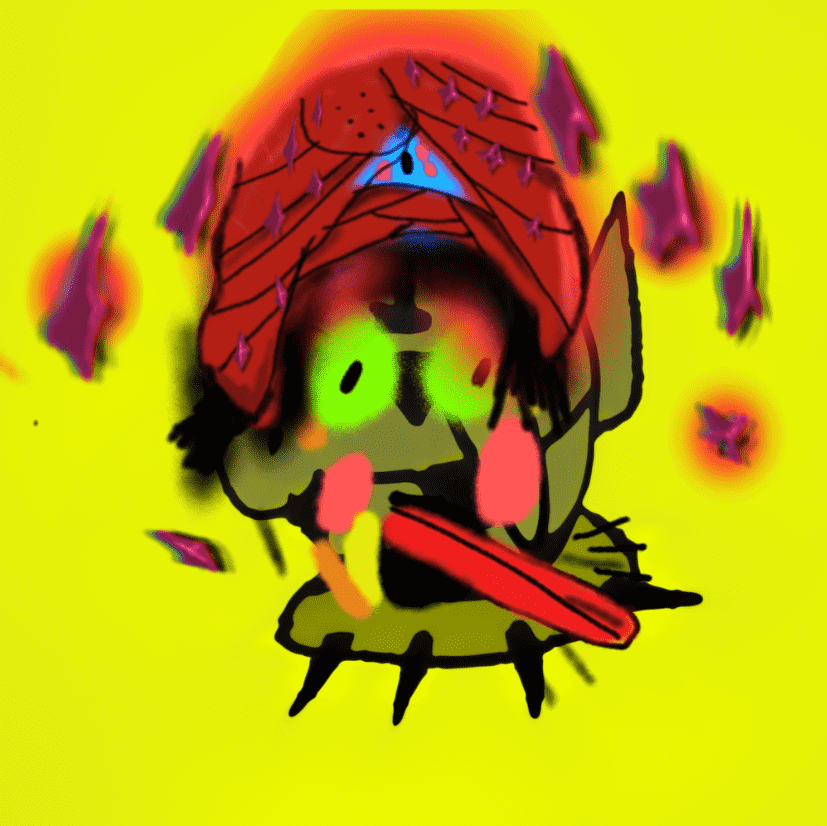

# TURBOLINIS

TURBOLINIS 是一种化学、神经和数字艺术的尝试。依靠数字神经网络以及即兴标记、即席写作和即兴创作，TURBOLINIS 展示了人、机器和 Goblini 之间的辩证关系——同时令人担忧和共生的关系。朋克以 $ETH 为杠杆。

朋克是杠杆朋克。V3Phunks 是杠杆式的 Phunks。呸。涡轮增压 #1326多么美学的涡轮！受sminem-colors的祝福，所有的认知，眼睛镜像，黏糊糊的……只涨？致阿纳托利的公开信 |通过无价值的像素 | 2022 年 8 月 |中等的

