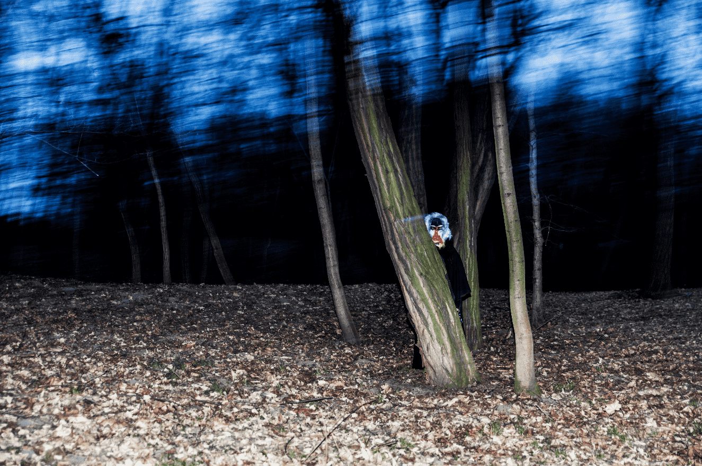

# Turn of the Tide

“Turn of the Tide”是 0bapek 和 Serap Görünme 的合作视觉探索，旨在捕捉心灵中的潮汐运动。由于我们知道 60% 是水，月亮不仅在水中产生潮汐，而且在我们所有人中也产生潮汐。本系列深入心灵深处，探索由他们创造的涨潮、退潮和潮间带。它观察我们如何用我们的感知创造二元性，生或死，快乐或悲伤，黑色或白色；他们的统一，在一个人的知识下，没有另一个人就不可能存在。“逆流而上”认为，感知的深度比表面上发生的事情更重要，某些经历正在转变，它们可能会导致新的思维方式，即使它们看起来难以应对当前. 从满月到新月。

