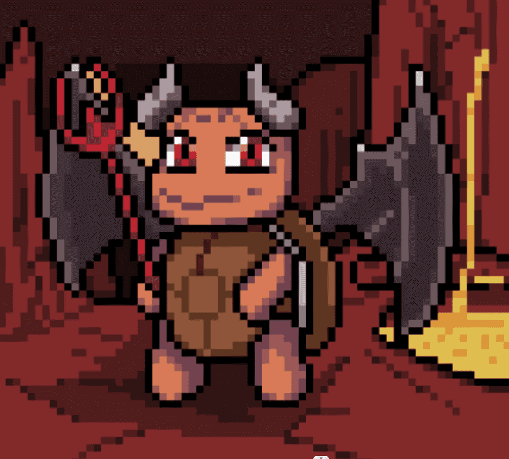

# TurtleVerse Official

TurtleVerse 是生活在以太坊区块链上的 3333 只海龟的集合。在暴露于放射性能量之后，海龟们开始生产 $ALGAE，并很快意识到他们能够将自己的力量提升到新的高度并进化……前 1111 只海龟将免费，剩余供应量将以 0.03 ETH 铸造

完成所有 3333 海龟的铸造。

OpenSea 在 24 小时内显示完整的薄荷

阶段2

所有海龟都将开始赚取 $ALGAE

75% 的铸币资金将被发送到海龟财政部，社区将对如何管理资金来发展 Turtleverse 进行投票

目前，国库基金将用于回购任何低于薄荷价格的海龟，并由团队持有用于赠品/营销。

50% 的二级/特许权使用费也将上缴国库。

10 只随机 1/1 创世海龟将空投给拥有 2 只以上海龟的持有者。

第三阶段

我们将在沙盒内购买一块土地并开始建造 TurtleVerse！

进化将上线（将 Genesis 与基础海龟与 $ALGAE 结合以获得惊喜......想知道当你融合 2 只 Genesis Turtles 时会发生什么......）

Evolved Turtles 将加速生产 $ALGAE。

